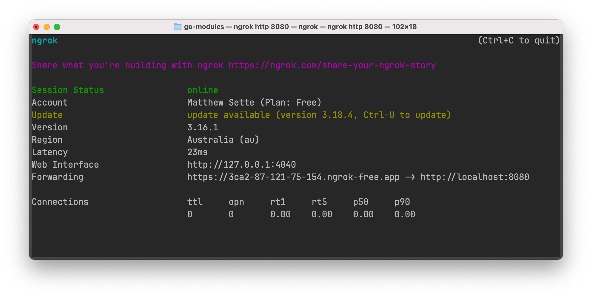
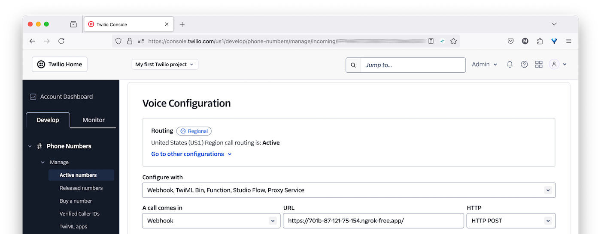

# Build a Post-Call Transcription Service with Go and Twilio

This is a small Go-powered web application that demonstrates how to perform post-call transcription using Twilio. 
If you’re not familiar with the term, post-call transcription is the process of converting a call recording to text, which can later be disseminated, as desired.

## Prerequisites

- [Go][go-download-url] 1.22 or above
- A Twilio account (free or paid) with a phone number. 
  [Click here to create one][twilio-signup-url], if you don't have one.
- A phone number that can make phone calls

## How Does The Code Work?

The application has three routes.
The default ("/") handles a POST request from Twilio sent after a call is made to a Twilio phone number.
It tells Twilio to let the user leave a voice message lasting a maximum of 600 seconds or 10 minutes, and to transcribe it. 
In addition, it tells Twilio to notify the application about two events:

- When the voice recording is *completed*, via a POST request to the "/recorded" route
- When the call transcription is *ready* via a POST request to the "/transcribed" route

The "/transcribed" route receives a POST request from Twilio containing [details about the transcribed call][transcribe-callback-url].
These include the phone number of the caller, the transcription text of the call, and the [call's SID][call-sid-url], which is the unique ID of the call.
These details are recorded in a small SQLite database.

The "/recorded" route receives a POST request from Twilio, containing [details about the recorded call][recording-status-callback-url].
The only detail that's extracted is the recording duration.
Using the call's SID, the relevant record in the calls table is then updated with the recording duration, and sets the recording status to completed.

## ⚡️ Quick Start

### Set up the Application

After cloning the code to wherever you store your Go projects, change into the project directory. 
Then, copy *.env.example* as *.env*, by running the following command:

```bash
cp -v .env.example .env
```

### Start the Application

When that's done, run the following command to launch the application (listening on port 8080):

```bash
go run main.go
```

Next, expose the application to the public internet so that Twilio can make the required requests to it. 
There are a variety of tools that do that, but I find ngrok the simplest. 
Run the following command, in a new terminal tab or session, to expose port 8080 on your development machine to the public internet.

```bash
ngrok http 8080
```

Once ngrok's started, copy the Forwarding URL from the output it writes to the terminal.





Then, open your [Twilio Console][twilio-console-url] and navigate to **Phone Numbers > Manage >** [Active Numbers][twilio-console-active-numbers-url].
There, click on the phone number that you want to use for this application.
Then, in the **Configure** tab, go to the **Voice Configuration** section and set:

- **Configure with** to "Webhook, TwiML Bin, Function, Studio Flow, Proxy Service"
- **A call comes in** to "Webhook"; *and*
  - The **URL** field for A call comes in to the ngrok Forwarding URL that you copied from the terminal
  - The **HTTP** field for A call comes in to "POST"

Then, scroll to the bottom of the page and click **Save configuration**.

### Test the Application

With the application ready to go, make a call to your Twilio phone number and leave a voice message as instructed.

## Contributing

If you want to contribute to the project, whether you have found issues with it or just want to improve it, here's how:

- [Issues][issues-url]: ask questions and submit your feature requests, bug reports, etc
- [Pull requests][prs-url]: send your improvements

## Did You Find The Project Useful?

If the project was useful and you want to say thank you and/or support its active development, here's how:

- Add a GitHub Star to the project
- Write an interesting article about the project wherever you blog

## License

[MIT][mit-license-url]

## Disclaimer

No warranty expressed or implied. Software is as is.

<!-- README Links -->
[twilio-signup-url]: https://login.twilio.com/u/signup?state=hKFo2SAzWlcxMHluNTRKY0RtWkdJRXZ6d1cwOGNaQ2tYNXZlbaFur3VuaXZlcnNhbC1sb2dpbqN0aWTZIHFaWjlxbUw2cnFkUUt0V0JjZGZKVUJHVEgwa2F4TDE2o2NpZNkgTW05M1lTTDVSclpmNzdobUlKZFI3QktZYjZPOXV1cks
[call-sid-url]: https://help.twilio.com/articles/223180488-What-is-a-Call-SID-
[recording-status-callback-url]: https://www.twilio.com/docs/voice/twiml/record#attributes-recording-status-callback
[transcribe-callback-url]: https://www.twilio.com/docs/voice/twiml/record#attributes-transcribe-callback
[go-download-url]: https://go.dev/doc/install
[issues-url]: https://github.com/settermjd/twilio-go-call-transcriber/issues
[prs-url]: https://github.com/settermjd/twilio-go-call-transcriber/pulls
[mit-license-url]: https://github.com/twilio-samples/sms-phone-verification-php/blob/main/LICENSE
[twilio-console-url]: https://console.twilio.com/
[twilio-console-active-numbers-url]: https://console.twilio.com/us1/develop/phone-numbers/manage/incoming